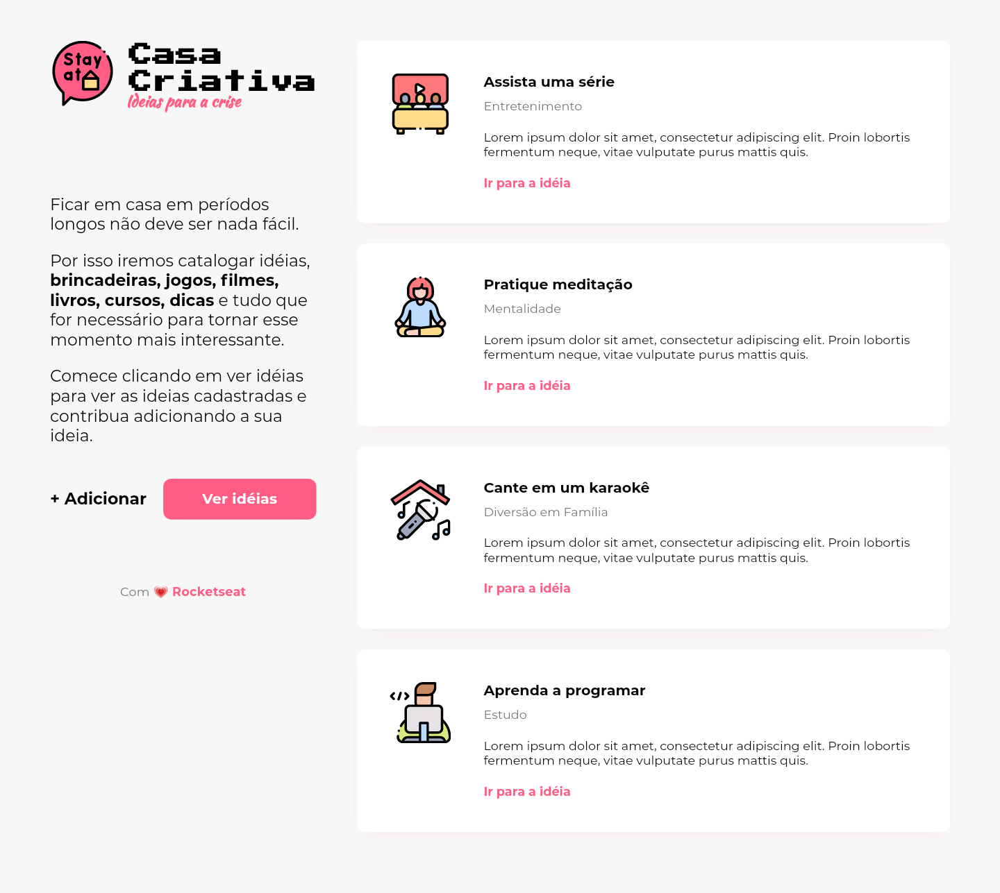

<h1 align="center">
  
    <br>
</h1>

<h4 align="center">
  Aplicação web para armazenar algumas ideias para fazer durante a pandemia do novo coronavirus
</h4>

<p align="center">


 
</p> 

## Tecnologias

Este projeto foi desenvolvido utilizando as seguintes tecnologias:

-  [Termux](https://termux.com/)
-  [Node.js](https://nodejs.org/)
-  [Express](https://expressjs.com/)
-  [sqlite3](https://sqlitebrowser.org/)
-  [nunjucks](https://www.npmjs.com/package/nunjucks)
-  [Acode](https://play.google.com/store/apps/details?id=com.foxdebug.acodefree)

## Como executar

### Requirementos
[Git](https://git-scm.com), [Node.js](https://nodejs.org/) v12.13.1 ou superior, [Npm](https://www.npmjs.com/), [SQLite3](https://sqlitebrowser.org/).
<br>

### Aplicação
Para executar a aplicação, você deverá clonar este repositório e instalar as dependências.
```bash
# clone o repositório
git clone https://github.com/arxnaldo/casacriativa.git

# acesse a pasta
cd casacriativa/

# instalando as dependências
npm install

# rodando a aplicação
npm start
```
<h1 align="center">
  
  
  
</h1>

## Licença

Este projeto está sob a licença MIT.

## Contato

[ LinkedIn ](https://www.linkedin.com/in/arnaldoux) <br>
[ Instagram ](https://instagram.com/arxnaldo)
